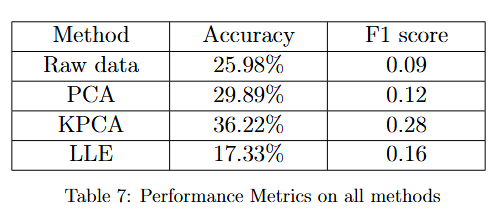

# Dimensionality-Reduction-Analysis

Simplifying complex data by exploring dimension reduction techniques with Animal-10 dataset. Efficiency of different dimension reduction techniques is analyzed by evaluating different data representation methods.

## Dataset
The data set used in this project is [Animal-10](https://www.kaggle.com/datasets/alessiocorrado99/animals10) found on Kaggle. This dataset contains  about 28K medium quality animal images belonging to 10 categories: dog, cat, horse, spyder, butterfly, chicken, sheep, cow, squirrel, elephant. Image count for each animal(category) varies from 2K to 5K images.

## Pre-processing
These images were converted to RGB format using python and the images have been imported as a .mat file. Due to restricted computational resources the images also have been reduced to 64 x 64 dimensions from 224 x 224 dimensions.

### Class balancing

The dataset has been balanced using oversampling the under-represented classes and undersampling the over-represented ones. After balancing the classes all the classes consists 2617 images making it a total of 26170 images across all the classes. 

    
    

### Reshaping

The original data was reshapes from a 4-dimensional (number of images, height, width, color channels) to a 2-dimensional matrix. The image data is now of the size 26170 x 12288 (number of images x dimensions).

The data was also normalized and centered

## Data split

I have split my data using a 80:10:10 ratio. The 80\% training data provides ample material for your model to learn. The 10\% validation and test sets, while smaller, still have enough images for effective hyperparameter tuning and unbiased evaluation without sacrificing a significant portion of training data. I split the data for raw data and ensured to use the same train, test, validation indices after reducing the dimensions using dimensionality reduction techniques.

## Dimensionality reduction

I built a KNN classifier on the raw data after pre processing the data. I plotted a 2D plot of all the classes for comparison with other plots after reducing the dimensions. The plot can be seen below in figure. 

Fig: 2D plot of raw data

### PCA

Due to limited amount of computational resources I was able to run PCA for only 6000 components which is almost half of the total components (64*64*3 = 12288). After running PCA to decide on the number of components to retain to transform the data I calculated explained variance and plotted a screeplot which can be seen in figure 8. We can also see the 2D representation of the data after reducing it using PCA in the figure. 

Fig: 2D plot of PCA data

Fig: Scree plot of PCA components

In the plot mentioned above in figure, we can observe that the data points are more spread out and separated compared to the raw data representation. This is because PCA aims to find a lower-dimensional subspace that best preserves the variance in the data, potentially making it easier to separate the classes. However, some overlap between classes is still evident, suggesting that linear methods like PCA may not be sufficient for this particular dataset.

I have considered a range of values in the elbow of the scree plot above and calculated the accuracy for all the values in increments of 50 and plotted graphs to pick the number of principal components to retain. The plots can be seen below. 

Fig: Variance vs components

Fig: Accuracy vs components

From the figure 9 we can see that retaining 400 components has the highest accuracy which is 29.4\% and it retains 87.2% of variance where as 650 components are giving an accuracy of 28.8% but are retaining a variance of 89.6%. Striking a balance between the variance retained as well as getting a good accuracy is important so I have considered to retain 600 components and the metrics can be seen in the below table. 

I observed that the accuracy of our model improved when compared to raw data. PCA works well when the relationships between features are linear. However, in image data, especially animal images, the relationships between pixel values can be highly nonlinear due to variations in color, texture, shape, and other visual attributes. Which is why we can see the accuracy of our model did not improve by a lot.

### Kernal PCA

I was unable to perform KPCA to preserve a said number of components like PCA due to computational resources. After reducing the number of components from 6000 till 100 I was always encountering the error of 'out of memory' hence had to leave the number of components to default (i.e, 2). the 2D representation of the data can be seen in the figure below.

We know that PCA finds linear combinations of the original features KPCA, on the other hand, is well-suited for capturing nonlinear relationships in image data by leveraging kernel functions. It can map data onto higher dimensional feature space where non-liner relationships are easier to capture. This allows KPCA to extract more meaningful features from the image data, capturing complex patterns and variations that PCA might miss.  Animal images often contain complex patterns and variations that can be well captured using certain non-linear techniques using KPCA making it a better fit and more effective 

### LLE

To reduce the dimensions of my data using LLE I have changed the value of the the number of neighbors that LLE will consider from 2 to 30 to see how the accuracy of the classification model will change with the change in the number of neighbors. Few of the results are discussed in the table below.

Fig: 2D representation of LLE

In the plot above, we can observe that the data points are more clustered and separated compared to both the raw data and PCA representations. While there is still some overlap between classes, LLE appears to have done a better job of separating the classes, especially for certain clusters or groups within each class. 

We can see above that the best accuracy for LLE occurred when we chose 30 neighbors which is closely followed by 10 neighbors. The number of neighbors in locally linear embedding (LLE) really matters. If we choose too many neighbors, like 30, LLE might smooth out the important details in the data and get confused by noise, which could make the results less accurate. Also, it might take longer to run and it does use up more computer resources. On the other hand, choosing fewer neighbors, like 10, strikes a better balance. It focuses on the most important details in your data while still running efficiently.

## Comparison

KPCA performed the best in terms of both accuracy and F1 score, likely due to its ability to capture non-linear patterns in the image data through kernel functions. 

PCA, a linear dimensionality reduction technique, improved accuracy over raw data by removing redundant or irrelevant features, but its linear nature may have limited its performance compared to non-linear methods, as reflected in its lower F1 score than LLE. 

LLE, another non-linear method that focuses on preserving local structures, had a higher F1 score than linear methods, suggesting it could better capture local patterns crucial for distinguishing between animal classes, although its lower accuracy indicates challenges in generalization. 

The raw data, without any dimensionality reduction or transformation, performed the worst, as the high-dimensional and potentially noisy image features made it difficult for machine learning algorithms to effectively learn the underlying patterns.

## Conclusion

The results highlight the importance of considering nonlinear methods for image classification tasks, as they can better model underlying patterns compared to linear techniques or raw representations.
